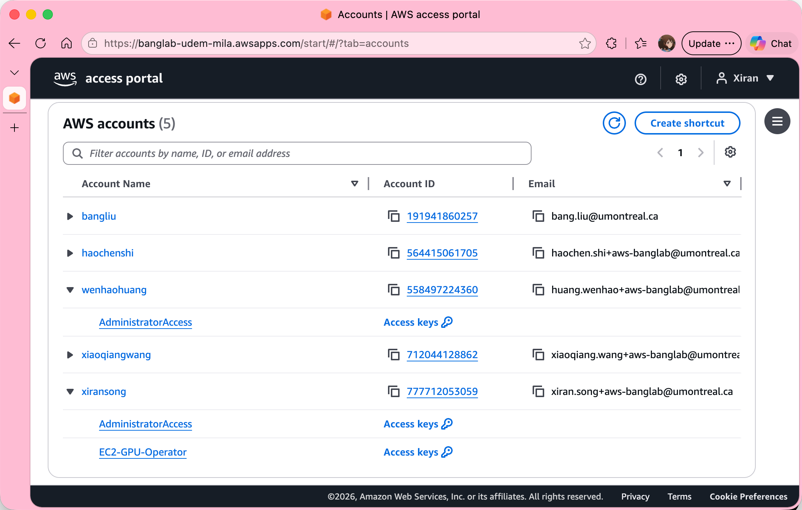
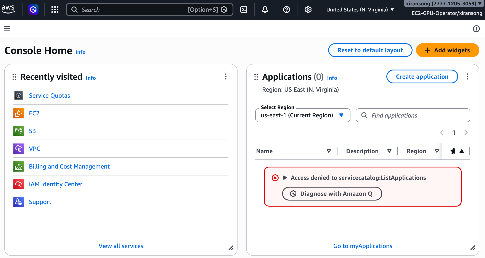

# Accounts and Access

This page explains **how access to AWS is structured in BangLab**.

If you feel that some AWS concepts are confusing at first — that is normal.
This section is here to remove that confusion.

---

## 1. AWS Accounts vs. Users

In AWS, **accounts** and **users** are two very different concepts.

### AWS Account

An **AWS account** is a **container of resources**.  
It owns things like:

- EC2 instances (including GPUs)
- S3 buckets and data
- service quotas (e.g. vCPU limits)
- billing and credits

In BangLab, one AWS account may contain resources from multiple researchers.
The account is the container, but individual resources still need clear
researcher ownership.

---

### AWS User

An **AWS user** represents a **real human** (you).

A user:

- logs in via SSO (Single Sign-On)
- does **not** directly own resources
- may have access to **multiple AWS accounts**

You can think of a user as: 

_A person who is allowed to operate inside one or more accounts._

---

### The Key Difference

Accounts and users are **not the same thing**.

- One **AWS account** can be accessed by **many users**
- One **user** can access **many AWS accounts**

This separation is intentional and is what allows labs and organizations
to manage shared infrastructure safely.

---

### Resource Ownership Inside Shared Accounts (Very Important)

Because multiple researchers may work in the same AWS account, BangLab assigns
each user an `Owner` value. This value is based on the
user's full-name-style username, for example `xiransong`, `alicezhang`, or
`bobchen`.

The `EC2-GPU-Operator` permission set (see below) uses this owner value to separate
resources:

- EC2 instances, EBS volumes, security groups, and EC2 key pairs use an
  `Owner=<username>` tag
- S3 buckets use the naming pattern `banglab-<username>-*`

This means two users can work in the same AWS account while still being
restricted to their own resources.

---

## 2. Permission Sets

An AWS account and a user are connected by a **permission set**.

A **permission set** defines:

- what actions a user is allowed to perform
- which services they can use
- what they are *not* allowed to do

---

### Example

- **Alice (user)**  
- **Alice (account)**  
- **EC2-GPU-Operator (permission set)**  

Together, this means:

_Alice can operate GPU EC2 instances and use S3 *within the limits defined by the EC2-GPU-Operator role*_

Another example:

- **Bob (user)**  
- **Alice (account)**  
- **AdministratorAccess (permission set)**  

This means:

_Bob has full administrative access over the Alice account_

---

### What Permission Sets Mean for You

As a researcher, you are not an administrator by default.

Instead, you are given a permission set designed specifically for
research workflows.

Currently, BangLab provides:

- **EC2-GPU-Operator** 

    - Launch, stop, and terminate your own GPU EC2 instances  
    - Manage your own EBS volumes, security groups, and EC2 key pairs
    - Access your own S3 storage  
    - View limited billing and usage information  

If something is blocked or unavailable in the console, it is usually
because it is outside the scope of the permission set.

---

## 3. AWS Access Portal

BangLab uses **Single Sign-On (SSO)** login to manage access: 

- you log in to the **AWS access portal**:

- you select an account and a permission set
- AWS grants you temporary access automatically

---

## 4. AWS Console

The **AWS Access Portal** is the **entry point** for logging in.
It is **not** where you manage AWS resources.

After logging in via the access portal and selecting:

- an AWS account, and
- a permission set (e.g. `EC2-GPU-Operator`),

you are redirected to the **AWS Management Console**:

The AWS Management Console (often called the **AWS console**) is:

- the main web interface for AWS,
- where you create and manage resources such as EC2 and S3,
- scoped by the permission set you selected.

In short:

- **AWS Access Portal** → *Who are you? Which account? Which role?*
- **AWS Console** → *Manage resources within that role*

Each permission set opens the AWS console
with a different set of allowed actions.

---

## Summary

- **AWS accounts** hold resources and billing
- **Users** represent real people
- **Permission sets** define what a user can do in an account
- **Owner values** separate researcher resources inside shared accounts
- You access AWS through an **SSO login**, not personal AWS accounts
