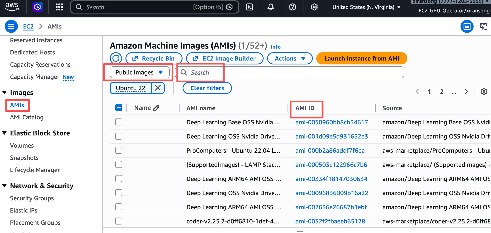
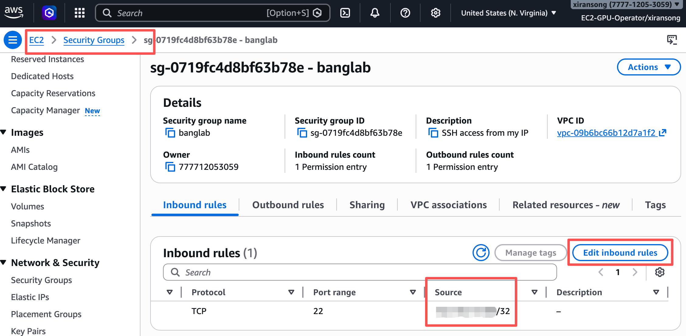
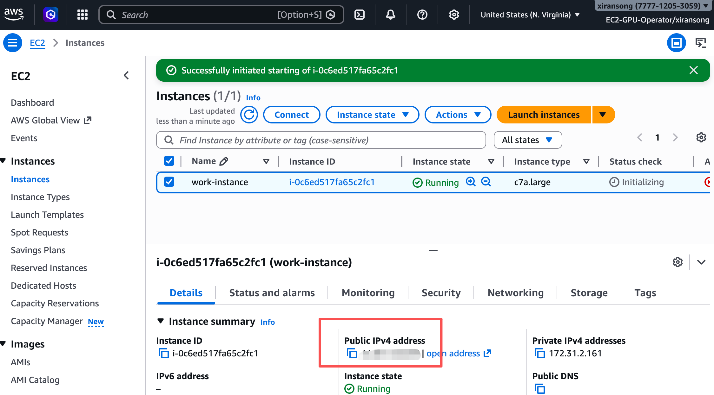
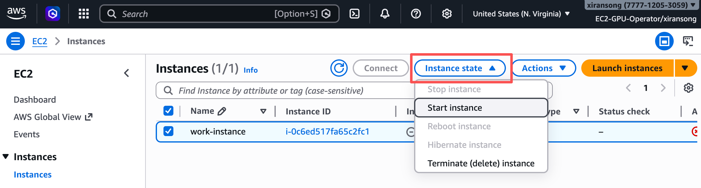

# CPU Instance Lifecycle

This tutorial walks through the **complete lifecycle of a CPU EC2 instance**,
from creation to termination.

We use a **CPU instance** as the first example because:

- it is cheaper,
- it behaves the same way as GPU instances,
- and it lets you learn the EC2 workflow safely.

We primarily use the **AWS CLI** to execute actions, and the **AWS console**
to monitor and verify state.

---

## Before You Start

Make sure you have:

- logged in to the AWS access portal: 
  [https://banglab-udem-mila.awsapps.com/start](https://banglab-udem-mila.awsapps.com/start)

- selected your account, and chosen **EC2-GPU-Operator** to open the AWS console

- authenticated in your laptop terminal using SSO:

```bash
aws sso login --profile <your-profile-name>
```

---

## Phase 0 — Create a Key Pair (One-Time Setup)

An EC2 key pair is used for **SSH access from your device**.

We recommend creating an SSH key locally and uploading **only the public key**
to AWS.

Generate a key pair (Press Enter to select the default values.):

```bash
ssh-keygen -t ed25519 -f ~/.ssh/banglab
```

Upload the public key to AWS:

```bash
aws ec2 import-key-pair \
  --region us-east-1 \
  --key-name banglab-key \
  --public-key-material fileb://~/.ssh/banglab.pub
```

You will reuse this key pair for future instances.

### Monitor in Browser

* EC2 → **Key Pairs**

  * Confirm `banglab-key` appears in the list

---

## Phase 1 — Choose an AMI (Ubuntu 22.04)

An **AMI (Amazon Machine Image)** defines the operating system of the instance.

We use **Ubuntu 22.04 LTS** as an example. You can either use the CLI or use the AWS console:

### Using the CLI

Find the latest Ubuntu 22.04 AMI:

```bash
aws ec2 describe-images \
  --region us-east-1 \
  --owners 099720109477 \
  --filters "Name=name,Values=ubuntu/images/hvm-ssd/ubuntu-jammy-22.04-amd64-server-*" \
  --query 'Images | sort_by(@, &CreationDate)[-1].ImageId' \
  --output text
```

Save the returned AMI ID (e.g. as an environment variable):

```bash
AMI_ID=ami-xxxxxxxx
```

### Using the Browser

In the AWS console:

* Go to **EC2 → AMIs**
* Search for “Ubuntu 22.04”




For later GPU instances, [Deep Learning Base AMI with Single CUDA](https://docs.aws.amazon.com/dlami/latest/devguide/aws-deep-learning-x86-base-with-single-cuda-ami-ubuntu-22-04.html)
is recommended. 
The Deep Learning Base AMI can also be used to run a CPU instance. 

---

## Phase 2 — Configure Security Group (SSH Access)

A **security group** acts as a virtual firewall.

We will allow:

* SSH (port 22)
* **only from your current public IP**

Create a security group:

```bash
aws ec2 create-security-group \
  --region us-east-1 \
  --group-name banglab-ssh \
  --description "SSH access from my IP"
```

Allow SSH from your IP:

```bash
MY_IP=$(curl -s https://checkip.amazonaws.com)

aws ec2 authorize-security-group-ingress \
  --region us-east-1 \
  --group-name banglab-ssh \
  --protocol tcp \
  --port 22 \
  --cidr ${MY_IP}/32
```

### Monitor or Edit in Browser

* EC2 → **Security Groups**

    * Check inbound rule: TCP 22 from your IP



---

## Phase 3 — Launch a CPU EC2 Instance

Now we launch the instance.

We use `t3.small` as an example:

* requires **2 vCPUs** for All Standard (A, C, D, H, I, M, R, T, Z) Spot Instance Requests (this is usually satisfied for a new AWS account)
* suitable for lightweight testing

Launch the instance:

```bash
aws ec2 run-instances \
  --region us-east-1 \
  --image-id ${AMI_ID} \
  --instance-type t3.small \
  --key-name banglab-key \
  --security-groups banglab-ssh \
  --block-device-mappings '[
    {
      "DeviceName": "/dev/sda1",
      "Ebs": {
        "VolumeSize": 30,
        "VolumeType": "gp3",
        "DeleteOnTermination": true
      }
    }
  ]' \
  --tag-specifications 'ResourceType=instance,Tags=[{Key=Name,Value=cpu-test}]'
```

### Notes

* **EBS (your disk) configuration**

    * Sets a 30 GB root volume
    * Data is deleted automatically when the instance is terminated

* **Tags**

    * `Value=cpu-test` helps identify the instance in the console
    * Tags are labels for organization and cost visibility

* **CLI output**

    * The command returns a large JSON response
    * Press `q` to exit the pager

### Monitor in Browser

* EC2 → **Instances**
* Watch state change: `pending` → `running`
* Check:

    * Instance type
    * **Instance ID**
    * **Public IPv4 address**
    * Tags

**You will need the public IPv4 address.** 



---

## Phase 4 — SSH into the Instance

Once the instance is `running`, connect via SSH (remember to copy and paste the IP address):

```bash
ssh -i ~/.ssh/banglab ubuntu@<PUBLIC_IP>
```

Run a sanity check:

```bash
uname -a
```

If this works, the instance is ready for use.

---

## Phase 5 — Stop, Start, and Terminate

You can Stop, Start, or Terminate in the AWS web console: 

* EC2 → **Instances**



Or you can use these commands in your laptop:

### Stop the Instance

```bash
aws ec2 stop-instances \
  --region us-east-1 \
  --instance-ids <INSTANCE_ID>
```

* Instance is powered off
* Storage (EBS) is preserved
* Billing **largely** stops

---

### Start the Instance Again

```bash
aws ec2 start-instances \
  --region us-east-1 \
  --instance-ids <INSTANCE_ID>
```

* Instance resumes
* Public IP **may change**

---

### Terminate the Instance (Final)

```bash
aws ec2 terminate-instances \
  --region us-east-1 \
  --instance-ids <INSTANCE_ID>
```

* Instance is permanently deleted
* Root disk data is lost
* This action **cannot be undone**

### Monitor in Browser

* EC2 → **Instances**
* Observe state transitions:

  * `running` → `shutting-down` → `terminated`

---

## Summary

In this tutorial, you learned how to:

* create and upload an SSH key pair,
* choose an Ubuntu 22.04 AMI,
* configure SSH access safely,
* launch a CPU EC2 instance with storage,
* connect via SSH,
* manage the full instance lifecycle.

This workflow applies directly to **GPU instances**,
with only minor changes.
